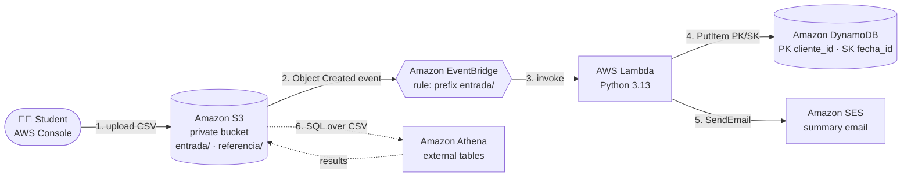
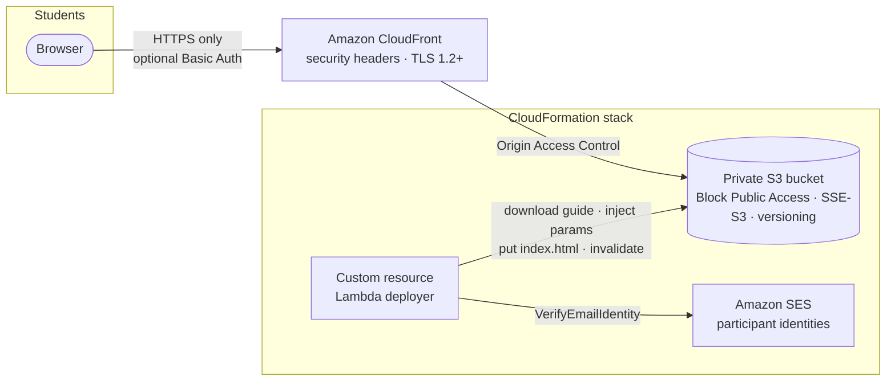
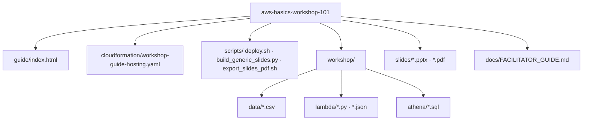

# AWS Basics Workshop 101 🚀

> A **2-hour, hands-on, guided introduction to AWS core services** for people who are new to the cloud:
> **Amazon S3, Amazon DynamoDB, Amazon SES, AWS Lambda (Python), Amazon EventBridge and Amazon Athena**.
> Bilingual guide (🇪🇸 Español / 🇺🇸 English), ClickOps step by step in the AWS Console, deployed **privately** with CloudFront + S3 through a single standalone CloudFormation template.

> Un **taller práctico y guiado de 2 horas** para personas nuevas en AWS. La guía es bilingüe, se sigue paso a paso en la consola (ClickOps) y se publica de forma **privada** con CloudFront + S3 mediante un único template de CloudFormation.

---

## What's inside / Contenido del repositorio

| Path | Description |
|------|-------------|
| `guide/index.html` | The workshop guide: a single, self-contained static page (ES/EN toggle, progress tracking, personalized resource names, downloadable CSVs, quiz). |
| `cloudformation/workshop-guide-hosting.yaml` | **Standalone** CloudFormation template: private S3 bucket + CloudFront (OAC, TLS 1.2, security headers) + custom resource that publishes the guide, injects the parameters (workshop name, participant emails, region, account) and pre-registers participant emails in SES. |
| `scripts/deploy.sh` | One-command deploy / update / delete of the hosting stack (optionally uploading the local guide). |
| `workshop/data/*.csv` | Reference data **in Spanish** (fictional Colombian transactions and customers) used throughout the labs. |
| `workshop/lambda/` | The Python Lambda (`procesar_transacciones.py`), test events and a least-privilege IAM policy. |
| `workshop/athena/` | The SQL scripts (database, external tables, analytical queries). |
| `slides/` | Generic intro deck *AWS Services Basics 101* (`.pptx` + `.pdf`) used before the hands-on part. |
| `scripts/build_generic_slides.py` | Script that produced the generic deck from the original customer-specific one (scrubs names/branding). |
| `scripts/export_slides_pdf.sh` | Headless `.pptx` → `.pdf` export with LibreOffice. |
| `docs/FACILITATOR_GUIDE.md` | Notes for the instructor: timing, prerequisites, permissions, costs, common issues. |

---

## The workshop / El taller

Students build, by hand, a small **serverless reconciliation automation**:



### Agenda (≈ 2 hours)

| # | Module | Min | Students do… |
|---|--------|----:|--------------|
| 0 | Welcome & setup | 10 | Sign in, select region, set personal initials, download CSVs |
| 1 | Amazon S3 | 15 | Create a private/versioned/encrypted bucket, prefixes, upload files, verify AccessDenied on public URL |
| 2 | Amazon DynamoDB | 15 | Create table with **PK/SK**, create items, Query vs Scan |
| 3 | Amazon SES | 10 | Verify email identity, understand sandbox, send test email |
| 4 | AWS Lambda (Python) | 25 | Create function, paste code, env vars, IAM role, timeout, test event, logs |
| 5 | Amazon EventBridge | 15 | Enable S3 → EventBridge, rule with pattern, upload CSV and watch the pipeline run |
| 6 | Amazon Athena | 15 | Result location, database, external tables over CSV prefixes, aggregations + JOIN |
| 7 | Wrap-up & cleanup | 10 | Explain the flow, delete resources, quiz, next steps |

Every module has: learning goals → key concept → numbered steps (with copy buttons and personalized names) → checkpoint → troubleshooting.

---

## Deploy the guide (instructor) / Despliegue de la guía

### Hosting architecture



* 🔒 The bucket is **never public**: Block Public Access on, bucket policy restricted to the CloudFront distribution (OAC), TLS enforced.
* 🌐 No S3 website hosting is used; delivery is CloudFront + S3 only.
* 🔑 Optional `GuideAccessPassword` adds HTTP Basic Auth (user `workshop`) through a CloudFront Function.
* ✉️ `ParticipantEmails` are registered as SES identities so every student receives the verification email **before** the SES module, and they are listed inside the guide.

### Option A: AWS Console (standalone template)

1. CloudFormation → **Create stack** → *Upload a template file* → `cloudformation/workshop-guide-hosting.yaml`.
2. Fill the parameters (workshop name, instructor email, participant emails separated by commas, optional password).
3. Acknowledge IAM capabilities → **Create stack** (≈ 5 minutes, CloudFront takes the longest).
4. Open the `GuideUrl` output and share it with the students.

By default the guide is downloaded from this repository (`GuideSourceUrl`). Set it to an empty string to deploy a placeholder and upload your own `index.html` with the `ManualUploadCommand` output.

### Option B: CLI script

```bash
export AWS_REGION=us-east-1
export WORKSHOP_NAME="AWS Basics Workshop 101 - Cohort 1"
export INSTRUCTOR_EMAIL="instructor@example.com"
export PARTICIPANT_EMAILS="ana@example.com,carlos@example.com"
export GUIDE_PASSWORD="cambiame-123"        # optional

scripts/deploy.sh            # guide fetched from GitHub
scripts/deploy.sh --local    # ...or upload the local guide/index.html (great while editing)
scripts/deploy.sh --delete   # tear everything down (bucket is emptied automatically)
```

### Run the guide locally (no AWS)

```bash
cd guide && python3 -m http.server 8765   # then open http://localhost:8765
```

---

## Student prerequisites / Prerrequisitos

* An AWS account or a Workshop Studio / IAM Identity Center user with permissions on S3, DynamoDB, Lambda, IAM (create role, attach policies), EventBridge, SES, Athena, Glue and CloudWatch Logs (`PowerUserAccess` + `iam:*Role*` is enough).
* An email inbox they can open during the session (SES sandbox verification).
* A modern browser. No local tools required.

Estimated cost per student: well under USD 0.10 (everything is serverless and the datasets are a few KB).

---

## Regenerate the slides / Regenerar las slides

```bash
# Generic deck from the original (scrubs customer name/branding, patches illustration)
~/.venv/bin/python scripts/build_generic_slides.py <original.pptx> slides/AWS_Services_Basics_101_SantiGarcia.pptx
# PDF (hidden slides are excluded, as in a handout)
scripts/export_slides_pdf.sh slides/AWS_Services_Basics_101_SantiGarcia.pptx
```

---

## Repository structure



---

# LICENSE

Copyright 2026 Santiago Garcia Arango
